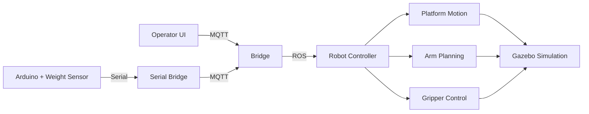

<div align="center">

# 🤖 LatteBot

### Mobile Manipulation for Smart Farming

*Autonomous dairy farm operations using industrial robotics and distributed systems*

[](http://wiki.ros.org/noetic)
[](https://www.python.org/)
[](http://gazebosim.org/)
[](https://moveit.ros.org/)

[Overview](#-overview) •
[Features](#-key-features) •
[Technologies](#-technologies-and-libraries) •
[Architecture](#-system-architecture) •
[Structure](#-project-structure) •
[Contributors](#contributors)

</div>

---

## 🎯 Overview

LatteBot is a ROS-based robotic system that automates dairy farm operations using a **Universal Robots UR10e manipulator** with **Robotiq 2F-140 gripper** mounted on a **10-meter linear mobile platform**. The system demonstrates autonomous bucket handling and delivery to multiple cow stalls through a distributed MQTT/ROS architecture.

### What It Does


**System Capabilities:**
- 🦾 **6-DOF robotic arm** with industrial parallel-jaw gripper
- 🚂 **10-meter linear platform** for multi-station operations  
- 🌐 **Multi-platform architecture** (Linux + Windows coordination)
- 📡 **MQTT/ROS bridge** with cloud-based message broker
- 🎮 **Interactive GUI** for sequence planning and monitoring
- ⚖️ **Arduino weight sensors** for milk consumption monitoring

---

## ✨ Key Features

<table>
<tr>
<td width="50%">

### 🎪 Complex Scenarios
- ✅ Incomplete feeding detection with timeout
- ✅ Parallel task management and queueing
- ✅ Multi-cow delivery sequences
- ✅ Automatic bucket lifecycle management

</td>
<td width="50%">

### 🔧 Advanced Control
- ✅ Three-phase grasp sequences (100% reliability)
- ✅ Collision-aware motion planning
- ✅ Thread-safe state management
- ✅ Dynamic model spawning

</td>
</tr>
</table>

---

## 🛠️ Interesting Techniques

### 🤖 ROS and Robotics

| Technique | Description | File |
|-----------|-------------|------|
| **[URDF/Xacro Macros](https://wiki.ros.org/xacro)** | Parametric robot descriptions with macro-based assembly | [`urdf/ur10e.urdf.xacro`](pkg01/urdf/ur10e.urdf.xacro) |
| **[MoveIt Planning](https://moveit.ros.org/)** | Collision-aware trajectory planning with named poses | [`ur10e_moveit_config/`](ur10e_moveit_config/) |
| **[Gazebo Physics](http://gazebosim.org/tutorials?tut=physics_params)** | Custom contact parameters (μ=2000, kp=5M) for reliable grasping | [`models/bucket/model.sdf`](pkg01/models/bucket/model.sdf) |
| **[ROS Control](http://wiki.ros.org/ros_control)** | Hardware abstraction for arm, gripper, and platform | [`controller/`](pkg01/controller/) |
| **[TF Transforms](http://wiki.ros.org/tf2)** | Complete kinematic chain from world to end effector | System-wide |

### 🐍 Python Control Systems

- **Thread-Safe Queues**: Lock-based sequence execution prevents race conditions → [`bridge_keypad2robot.py`](pkg01/scripts/bridge_keypad2robot.py)
- **State Machine Pattern**: Multi-phase grasp (open → pre-grasp → close) → [`robot_movement.py`](pkg01/scripts/robot_movement.py)
- **[Action Servers](http://wiki.ros.org/actionlib)**: Non-blocking trajectory execution with feedback
- **Dynamic SDF Modification**: Runtime model name changes for grasp plugin compatibility

### 📡 MQTT Integration

- **[Paho MQTT](https://pypi.org/project/paho-mqtt/)**: TLS-encrypted pub/sub
- **Bidirectional Bridging**: MQTT ↔ ROS topic translation with state tracking
- **Distributed Architecture**: Windows UI ↔ Cloud Broker ↔ Linux Controller

### 🎨 GUI Development

- **[Tkinter](https://docs.python.org/3/library/tkinter.html)**: Custom numerical keypad with sequence planning → [`numerical_keypad.py`](pkg01/scripts/numerical_keypad.py)
- **Scrollable Canvas**: Dynamic content with mousewheel support
- **State Visualization**: Real-time cow availability tracking

### 🔌 Arduino Integration

- **Custom Binary Protocol**: Efficient serial communication with header (`\xff`) and payload structure → [`bridge_serial2MQTT.py`](pkg01/scripts/bridge_serial2MQTT.py)
- **Weight Monitoring**: Load cell simulation with button-based weight changes and LCD display
- **Auto-detection**: COM port discovery via device description matching
- **Event-Based Publishing**: Triggers MQTT messages when milk consumption thresholds are met or timeout occurs (20 seconds)
- **Serial → MQTT Bridge**: Translates Arduino sensor data to MQTT topics (`cow/{calf_num}`) for robot coordination

---

## 📚 Technologies and Libraries

<details>
<summary><b>🤖 Robotics Stack</b></summary>

- **[ROS Noetic](http://wiki.ros.org/noetic)** - Robot Operating System for Linux/WSL
- **[MoveIt](https://moveit.ros.org/)** - Motion planning framework with OMPL/CHOMP planners
- **[Gazebo 11](http://gazebosim.org/)** - 3D physics simulator with ODE solver
- **[Universal Robots ROS Drivers](https://github.com/UniversalRobots/Universal_Robots_ROS_Driver)** - UR10e kinematics and controllers
- **[Robotiq Gripper Package](https://github.com/ros-industrial/robotiq)** - 2F-140 gripper URDF with mimic joint plugin
- **[Gazebo Grasp Plugin](https://github.com/JenniferBuehler/gazebo-pkgs)** - Contact-based grasping simulation

</details>

<details>
<summary><b>📡 Communication</b></summary>

- **[HiveMQ Cloud](https://www.hivemq.com/mqtt-cloud-broker/)** - Managed MQTT broker with TLS encryption (port 8883)
- **[Paho MQTT Python](https://pypi.org/project/paho-mqtt/)** - v1.6.1 client library
- **[PySerial](https://pypi.org/project/pyserial/)** - Arduino integration for weight sensor simulation

</details>

<details>
<summary><b>🐍 Python Environment</b></summary>

- **[rospy](http://wiki.ros.org/rospy)** - ROS Python client library
- **[moveit_commander](http://docs.ros.org/en/melodic/api/moveit_commander/html/index.html)** - Python interface for MoveIt
- **[tf.transformations](http://docs.ros.org/en/jade/api/tf/html/python/transformations.html)** - Quaternion and Euler angle conversions
- **[ConfigParser](https://docs.python.org/3/library/configparser.html)** - INI file parsing for MQTT/serial settings

</details>

<details>
<summary><b>🔧 Hardware & Embedded</b></summary>

- **[Arduino](https://www.arduino.cc/)** - Microcontroller for weight sensor simulation
- **[Adafruit SSD1306](https://github.com/adafruit/Adafruit_SSD1306)** - OLED display library for weight visualization
- **Custom Serial Protocol** - Binary message format with header/payload/footer structure

</details>

---

## 📁 Project Structure
```
📦 lattebot/
├── 📂 .github/                       # GitHub configuration
│   ├── 📄 copilot-instructions.md    # Complete system architecture reference
│   └── 📄 COPILOT_INSTRUCTIONS_UPDATE.md
├── 📂 pkg01/                         # Main ROS package ⭐
│   ├── 📂 config/                    # MQTT/serial configuration
│   ├── 📂 controller/                # Joint controller parameters
│   ├── 📂 launch/                    # ROS launch files for simulation
│   ├── 📂 models/                    # Custom Gazebo models (bucket, cow)
│   ├── 📂 scripts/                   # Python control scripts & bridges
│   │   ├── 🐍 robot_movement.py      # Main robot controller
│   │   ├── 🐍 bridge_keypad2robot.py # MQTT → ROS bridge
│   │   ├── 🐍 bridge_serial2MQTT.py  # Arduino → MQTT bridge
│   │   ├── 🐍 pickup_site.py         # Operator interface
│   │   ├── 🐍 numerical_keypad.py    # GUI components
│   │   └── 📂 calf_arduino/          # Arduino firmware
│   │       └── 🔧 calf_arduino.ino   # Weight sensor code
│   ├── 📂 urdf/                      # Robot description (xacro format)
│   ├── 📂 world/                     # Gazebo world definitions
│   ├── 📂 claude_explanations/       # Troubleshooting documentation 📖
│   └── 📂 meshes/                    # 3D models for visualization
├── 📂 ur10e_moveit_config/           # MoveIt configuration package ⭐
│   ├── 📂 config/                    # Planning parameters & SRDF
│   └── 📂 launch/                    # Motion planning launch files
├── 📂 robotiq/                       # Robotiq gripper packages (gitignored)
├── 📂 roboticsgroup_gazebo_plugins/  # Mimic joint plugin (gitignored)
└── 📄 requirements.txt               # Python dependencies
```

### 📌 Key Directories

| Directory | Description |
|-----------|-------------|
| **[`pkg01/claude_explanations/`](pkg01/claude_explanations/)** | 📖 Comprehensive markdown docs covering physics tuning, collision troubleshooting, and grasp reliability - essential reading |
| **[`pkg01/scripts/`](pkg01/scripts/)** | 🐍 All executable Python scripts: robot controller, MQTT bridges, test utilities |
| **[`pkg01/scripts/calf_arduino/`](pkg01/scripts/calf_arduino/)** | 🔧 Arduino firmware for weight sensor simulation with OLED display |
| **[`pkg01/models/bucket/`](pkg01/models/bucket/)** | 🪣 Custom SDF model with extreme physics (μ=2000, kp=5M) for stable grasping |
| **[`ur10e_moveit_config/config/`](ur10e_moveit_config/config/)** | ⚙️ MoveIt configuration with manually tuned collision matrices and named poses |

---

## 🏗️ System Architecture

The project uses a **three-tier distributed architecture**:

### Component Overview

| Component | Platform | Purpose |
|-----------|----------|---------|
| **Operator Interface** | Windows | Tkinter GUI for planning cow milking sequences |
| **MQTT Bridge** | Linux/WSL | Translates MQTT messages to ROS topics with queue management |
| **Robot Controller** | Linux/WSL | Orchestrates platform motion, MoveIt planning, and gripper control |
| **Serial Bridge** | Windows | Reads Arduino sensor data and publishes to MQTT |
| **Arduino System** | Hardware | Monitors bucket weight via load cells with OLED display |
| **Gazebo Simulation** | Linux/WSL | Executes physics-based movements with contact-based grasping |

### Communication Flow

**MQTT Topics**:
- `Pickup-Site` → Complete sequence data from operator to bridge
- `cow/{calf_num}` → Weight sensor triggers from Arduino to bridge

**ROS Topics**:
- `/calf_num` → Task commands from bridge to robot controller
- `/ur10e_robot/joint_states` → Joint positions for monitoring
- `/ur10e_robot/*_controller/follow_joint_trajectory` → Action servers for motion execution

**Message Protocol**: HiveMQ Cloud broker with QoS 2 (exactly-once delivery) ensures reliable communication across Windows/Linux boundary.

### Arduino Serial Protocol

The Arduino communicates via a custom binary protocol over serial (9600 baud):
```
[ 0xFF | Calf_Num | Weight | 0xFE ]
  ^       1 byte    1 byte    ^
  Header                       Footer
```

**Trigger Conditions**:
- ✅ Weight drops below `starting_weight - milk_limit` → Publishes `1` (cow finished)
- ⏰ 120-second timeout → Publishes `0` (incomplete feeding)

---

## Acknowledgements

This project builds upon several open-source robotics packages:

- **[roboticsgroup_gazebo_plugins](https://github.com/roboticsgroup/roboticsgroup_gazebo_plugins)** - Mimic joint plugin for Robotiq gripper linkage simulation
- **[ros-industrial-attic/robotiq](https://github.com/ros-industrial-attic/robotiq/tree/kinetic-devel)** - Robotiq 2F-140 URDF models and visualization meshes
- **[gazebo-pkgs](https://github.com/JenniferBuehler/gazebo-pkgs)** - Gazebo grasp fix plugin for contact-based object grasping
- **[general-message-pkgs](https://github.com/JenniferBuehler/general-message-pkgs)** - Supporting message definitions for grasp plugin

---

## Contributors

<table>
<tr>
    <td align="center">
        <a href="https://github.com/Cristian-2001">
            
            <br />
            <sub><b>Casali Cristian</b></sub>
        </a>
    </td>
    <td align="center">
        <a href="https://github.com/aldoflotta">
            
            <br />
            <sub><b>Flotta Aldo</b></sub>
        </a>
    </td>
</tr>
</table>

---

*Developed as part of Smart Robotics course project, A.Y. 2024/2025*
